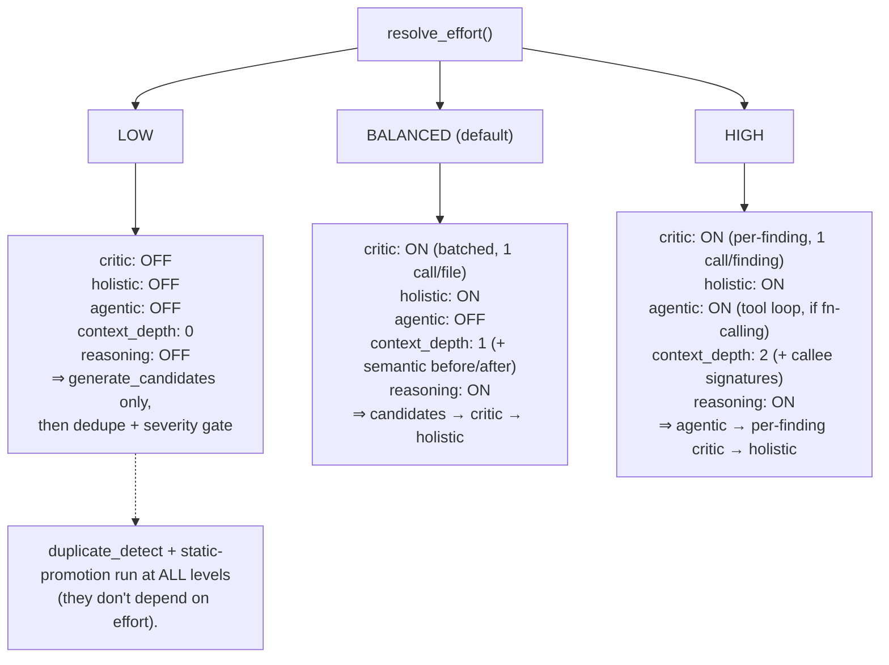
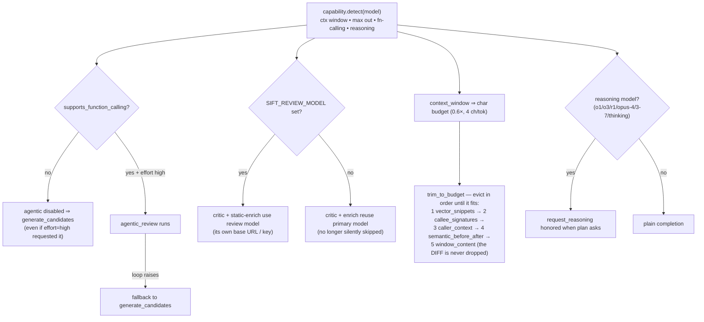
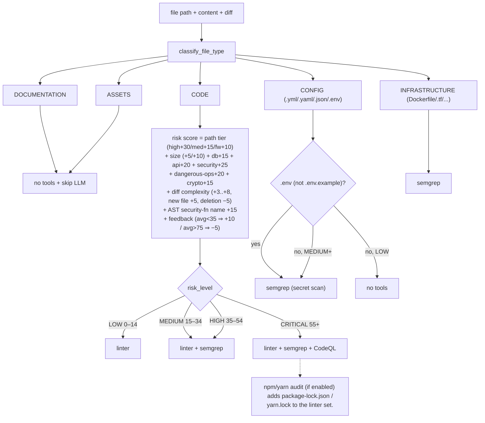
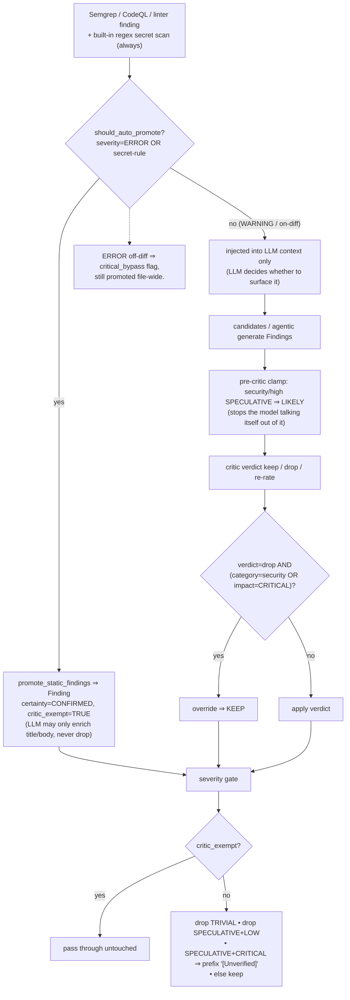
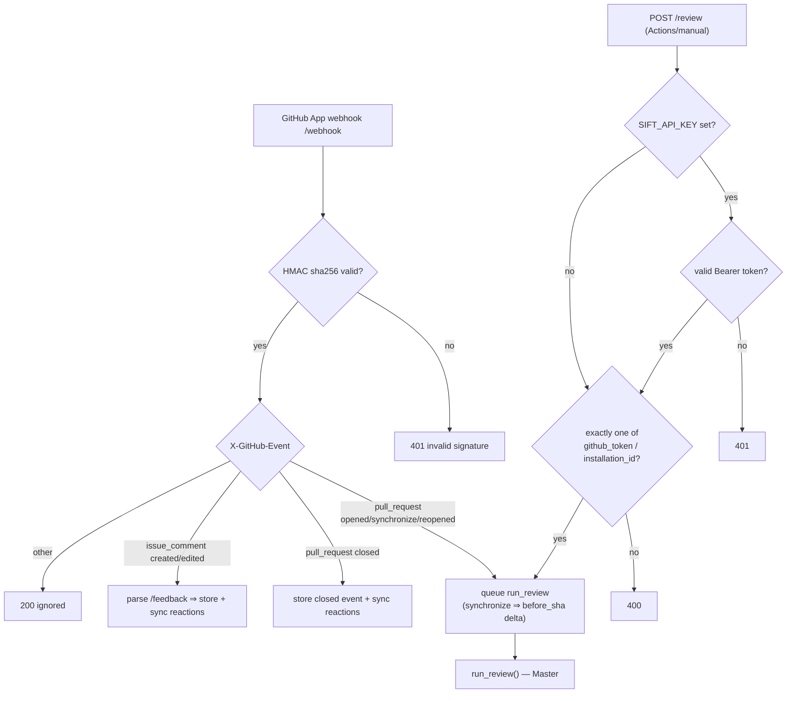
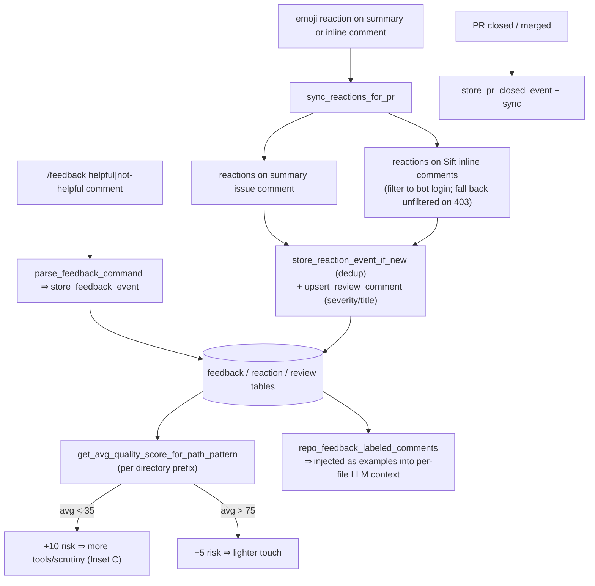

# Sift — Flow Reference

Developer-grade map of every path a review can take through Sift.

**Reading model:** one **master** lifecycle diagram (trigger → pipeline → output → block → feedback loop), plus **six insets** that zoom into the orthogonal axes referenced by the master. The master assumes the always-ON base (Semgrep, CodeQL, VectorDB installed/enabled) and **Smart Routing ON**; the routing-OFF degenerate path is called out as a note. Optional features beyond the base appear as `(if enabled)` branches. Caching / diff-dedup / concurrency are shown as condensed notes, not nodes.

Orthogonal axes that independently reshape a run:

1. **Effort** — `low` / `balanced` / `high` (Inset A)
2. **Model capability** — function-calling, reasoning, context window (Inset B)
3. **Per-file routing** — file type × risk score (Inset C)
4. **Finding origin** — static-promoted vs LLM-generated (Inset D)

---

## Master — Full review lifecycle

> Trigger of any kind funnels into `run_review`. The per-file fan-out is the heart; cross-file passes and the severity gate finish the finding set; output posts to GitHub; the dashed edge is the self-improving feedback loop that feeds future risk routing.

```mermaid
flowchart TD
    %% ---------- Triggers ----------
    subgraph TRIG["① Trigger & auth — see Inset E"]
        WH["GitHub webhook<br/>(HMAC signature verified)"]
        ACT["POST /review<br/>(Actions / manual)<br/>Bearer key if SIFT_API_KEY set"]
        WH -->|"pull_request:<br/>opened / synchronize / reopened"| RR
        WH -->|"pull_request: closed"| CLOSED["store_pr_closed_event<br/>+ sync_reactions"]
        WH -->|"issue_comment:<br/>/feedback helpful or not-helpful"| FB["store_feedback_event<br/>+ sync_reactions"]
        ACT -->|"github_token XOR installation_id<br/>optional before_sha"| RR
    end

    RR["run_review()"] --> TOK{"auth mode"}
    TOK -->|github_token| DIFF
    TOK -->|installation_id| MINT["get_installation_token"] --> DIFF

    DIFF["get_diff_for_review<br/>(before_sha ⇒ delta-only review)"]
    DIFF -->|empty diff| STOP1["return — nothing to review"]
    DIFF -->|has diff| HEAD["get PR head commit"]

    HEAD --> PEND{"SIFT_BLOCK_PRS_ENABLED?"}
    PEND -->|yes| PENDSET["commit status = pending"] --> SPLIT
    PEND -->|no| SPLIT

    SPLIT["split_diff_by_file"]
    SPLIT -->|no file chunks| STOP2["block: success 'no changes' / return"]
    SPLIT -->|chunks| FETCH["fetch file contents<br/>(read semaphore; inject package-lock /<br/>yarn.lock if package.json present)"]

    %% ---------- Static stage ----------
    FETCH --> ROUTE["② Smart Routing — classify + risk-score<br/>each file ⇒ tool sets — see Inset C"]
    ROUTE --> STATIC["Static tools (gated by routing):<br/>Semgrep • linters • CodeQL(whole repo)<br/>+ p/express,p/nodejs on server files (if framework rules)"]
    STATIC --> ASTG["AST: extract modified functions<br/>+ resolve PR import graph"]

    note1["NOTE — Routing OFF: Semgrep runs on ALL files,<br/>CodeQL on whole repo, nothing skipped,<br/>risk scoring inactive (Inset C is dead for that run)."]
    note2["NOTE — mechanics: identical file diffs reviewed once<br/>(content hash); Semgrep/linter/CodeQL results are<br/>TTL-cached (hit/miss split) when tool cache enabled."]
    ROUTE -.-> note1
    STATIC -.-> note2

    %% ---------- Per-file fan-out ----------
    ASTG --> FAN["Per-file fan-out<br/>(review semaphore + stagger; once per unique diff)"]
    FAN --> SKIP{"docs / assets?<br/>(routing)"}
    SKIP -->|yes| DROPF["skip LLM for this file"]
    SKIP -->|no| FILT["Filter static findings to diff:<br/>on-diff WARNING/ERROR + ERROR file-wide bypass<br/>+ built-in secret scan (always)"]

    FILT --> VEC{"VectorDB on?"}
    VEC -->|yes| VSEARCH["embed changed funcs ⇒ search_similar<br/>⇒ inject similar_snippets; queue upsert"] --> CTX
    VEC -->|no| CTX
    CTX["build_context — effort-scaled retrieval<br/>(window, semantic before/after, callees,<br/>caller ctx, vector) trimmed to budget — Inset B"]

    CTX --> PROMO["promote_static_findings:<br/>ERROR/secret ⇒ critic_exempt Findings — Inset D"]
    PROMO --> GENMODE{"enable_agentic<br/>AND fn-calling? (Inset A/B)"}
    GENMODE -->|yes| AGENT["agentic_review<br/>(bounded tool loop;<br/>falls back to candidates on error)"]
    GENMODE -->|no| CAND["generate_candidates<br/>(single-shot)"]
    AGENT --> MERGE
    CAND --> MERGE
    MERGE["merge promoted + candidates"] --> CRIT{"run_critic AND<br/>candidates exist? (Inset A)"}
    CRIT -->|yes| CRITIC["critique — per-finding (high)<br/>or batched (balanced);<br/>critic_exempt bypass — Inset D"]
    CRIT -->|no| DEDUP
    CRITIC --> DEDUP["rule_dedupe — one finding per (path,line)"]

    DROPF --> JOIN
    DEDUP --> JOIN["collect per-file findings"]

    %% ---------- Cross-file + gate ----------
    JOIN --> DUP["duplicate_detect — intra-PR copy/paste<br/>(deterministic, LLM-free, critic_exempt, always)"]
    DUP --> HOL{"run_holistic? (Inset A)"}
    HOL -->|yes| HOLP["review_holistic — whole-PR digest<br/>⇒ new cross-file/design findings"]
    HOL -->|no| GATE
    HOLP --> GATE["apply_severity_gate<br/>(drop trivial / speculative-low;<br/>flag speculative-critical; exempt bypass) — Inset D"]

    %% ---------- Output ----------
    GATE --> UPSERT["flush VectorDB upsert queue (if on)"]
    UPSERT --> POST["merge comments by line ⇒ filter to diff lines<br/>⇒ summarize_review (LLM)"]
    POST --> PUBLISH["post summary issue comment<br/>+ inline review (if any) ⇒ store_review"]
    PUBLISH --> BLOCK{"SIFT_BLOCK_PRS_ENABLED?"}
    BLOCK -->|yes| EVAL["evaluate_block_policy ⇒<br/>commit status success / failure"]
    BLOCK -->|no| DONE["done"]
    EVAL --> DONE

    %% ---------- Feedback loop ----------
    PUBLISH -.->|"reactions + /feedback later"| FBLOOP["⑥ Feedback loop — Inset F"]
    FBLOOP -.->|"avg quality per path-prefix"| ROUTE
    CLOSED -.-> FBLOOP
    FB -.-> FBLOOP
```

---

## Inset A — Effort plans

> `SIFT_REVIEW_EFFORT` selects one frozen plan (invalid ⇒ `balanced`). The plan flips six switches that the master reads at the gates marked *(Inset A)*. This is the axis your "Primary + Critic + Medium" framing names.

---

## Inset B — Model capability fallbacks

> Capability is detected per model string (cached; overridable). It does **not** add features — it gracefully degrades whatever the effort plan asked for, so a weak local model still produces a review.

---

## Inset C — Smart routing matrix

> Per file: classify type (path only) → risk score (path + content + diff + AST + feedback) → bucket → tool set. Drives which static tools run and whether the file reaches the LLM. **The whole inset is inert when Smart Routing is OFF.**

---

## Inset D — Static-finding lifecycle (origin & guards)

> Where a finding *comes from* decides whether it can be silenced. Static ERROR/secret findings are confirmed and bypass every LLM gate; LLM findings must survive critic + severity gate. This is the "multiple routes for the same input" axis.

---

## Inset E — Trigger & auth matrix

> Every entry funnels into `run_review` or the feedback path. Two independent auth schemes: webhook HMAC vs `/review` bearer key; and inside the job, App installation token vs raw token.

---

## Inset F — Feedback loop internals

> Human reactions and `/feedback` commands become structured events, which roll up into a per-directory quality score. That score (a) nudges future **risk routing** and (b) seeds the LLM with labeled examples — closing the loop drawn dashed in the master.

